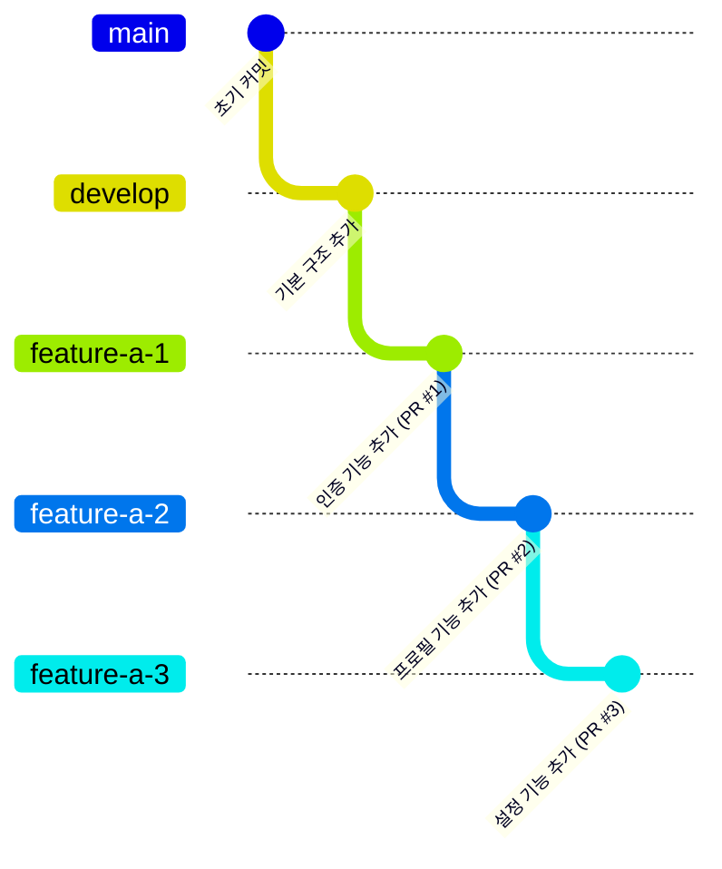
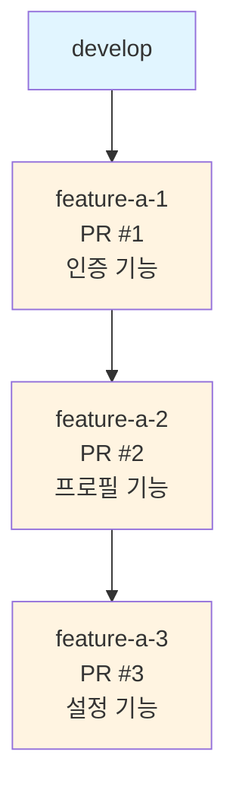

# Stacked Pull Request 가이드 레포지토리

Git Flow 기반의 Stacked Pull Request 사용법을 배우기 위한 예제 레포지토리입니다.

## 📚 목적

이 레포지토리는 다음과 같은 상황을 시뮬레이션합니다:

- 여러 개의 연관된 피쳐를 작은 단위로 나누어 PR을 만드는 방법
- 각 PR이 이전 PR을 기반으로 하는 Stacked PR 구조
- **가장 중요**: 첫 번째 PR에 리뷰가 반영되어 코드가 수정되었을 때, 나머지 브랜치들을 효율적으로 갱신하는 방법

## 🏗️ 현재 구조

### 브랜치 관계도



### 의존성 구조



## 🚀 시작하기

### 1. 가이드 문서 읽기

**[STACKED_PR_GUIDE.md](./STACKED_PR_GUIDE.md)** 파일을 먼저 읽어보세요. 여기에 Stacked PR의 개념과 사용법이 상세히 설명되어 있습니다.

### 2. 예제 PR 확인하기

현재 3개의 예제 PR이 열려있습니다:

- [PR #1: feature-a-1](https://github.com/moon-deepmedi/Stacked-PR-Guide/pull/1) - 사용자 인증 기능
- [PR #2: feature-a-2](https://github.com/moon-deepmedi/Stacked-PR-Guide/pull/2) - 사용자 프로필 기능
- [PR #3: feature-a-3](https://github.com/moon-deepmedi/Stacked-PR-Guide/pull/3) - 사용자 설정 기능

### 3. 실습하기

#### 시나리오: feature-a-1에 리뷰 반영하기

1. `feature-a-1` 브랜치에 리뷰를 반영하여 코드를 수정합니다
2. 변경사항을 커밋하고 push합니다
3. `feature-a-2`와 `feature-a-3`를 rebase하여 갱신합니다

자세한 방법은 [STACKED_PR_GUIDE.md](./STACKED_PR_GUIDE.md)의 "리뷰 반영 후 브랜치 갱신하기" 섹션을 참고하세요.

## 📖 주요 학습 내용

### Stacked PR의 장점

1. **작은 단위의 리뷰**: 각 PR이 작고 집중되어 있어 리뷰가 쉬움
2. **독립적인 병합**: 각 피쳐를 독립적으로 병합 가능
3. **명확한 의존성**: 각 피쳐의 의존 관계가 명확함

### 핵심 개념

- **Base 브랜치**: 각 PR의 기준이 되는 브랜치
- **Rebase**: 브랜치를 최신 상태로 갱신하는 방법
- **Force Push**: 이미 열린 PR을 갱신하기 위한 방법 (`--force-with-lease` 사용)

## 🔧 사용된 기술

- Git
- GitHub
- Python (예제 코드)

## 📝 예제 코드 구조

```
src/
├── main.py      # 메인 진입점
├── auth.py      # 인증 기능 (feature-a-1)
├── profile.py   # 프로필 기능 (feature-a-2)
└── settings.py  # 설정 기능 (feature-a-3)
```

각 모듈은 이전 모듈을 사용하여 순차적인 의존성을 보여줍니다.

## 🤝 기여하기

이 레포지토리는 학습 목적으로 만들어졌습니다. 실습을 통해 Stacked PR의 사용법을 익혀보세요!

## 📚 참고 자료

- [Git Rebase 공식 문서](https://git-scm.com/book/en/v2/Git-Branching-Rebasing)
- [Stacked Diffs 가이드](https://graphite.dev/blog/stacked-diffs)
- [STACKED_PR_GUIDE.md](./STACKED_PR_GUIDE.md) - 상세 가이드

## ⚠️ 주의사항

- Force push는 신중하게 사용하세요 (`--force-with-lease` 권장)
- 팀원들과 협의 후 rebase를 수행하세요
- PR은 항상 아래에서 위로 순차적으로 병합해야 합니다
